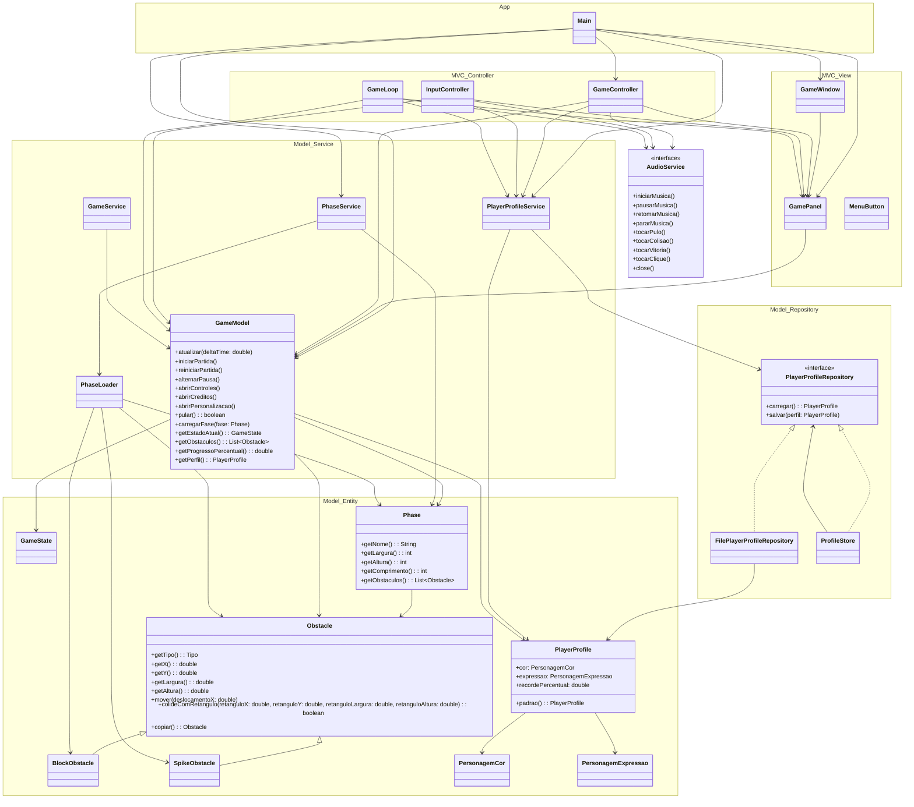

# Diagrama de classes — Geometry Dash POO

```mermaid
classDiagram
    namespace MVC_View {
        class GameWindow
        class GamePanel
        class MenuButton
    }

    namespace MVC_Controller {
        class GameController
        class InputController
        class GameLoop
    }

    namespace Model_Entity {
        class GameState
        class Obstacle {
            +getTipo(): Tipo
            +getX(): double
            +getY(): double
            +getLargura(): double
            +getAltura(): double
            +mover(deslocamentoX: double)
            +colideComRetangulo(retanguloX: double, retanguloY: double, retanguloLargura: double, retanguloAltura: double): boolean
            +copiar(): Obstacle
        }

        class BlockObstacle
        class SpikeObstacle
        class Phase {
            +getNome(): String
            +getLargura(): int
            +getAltura(): int
            +getComprimento(): int
            +getObstaculos(): List~Obstacle~
        }

        class PlayerProfile {
            +cor: PersonagemCor
            +expressao: PersonagemExpressao
            +recordePercentual: double
            +padrao(): PlayerProfile
        }

        class PersonagemCor
        class PersonagemExpressao
    }

    namespace Model_Repository {
        class PlayerProfileRepository {
            <<interface>>
            +carregar(): PlayerProfile
            +salvar(perfil: PlayerProfile)
        }

        class FilePlayerProfileRepository
        class ProfileStore
    }

    namespace Model_Service {
        class GameModel {
            +atualizar(deltaTime: double)
            +iniciarPartida()
            +reiniciarPartida()
            +alternarPausa()
            +abrirControles()
            +abrirCreditos()
            +abrirPersonalizacao()
            +pular(): boolean
            +carregarFase(fase: Phase)
            +getEstadoAtual(): GameState
            +getObstaculos(): List~Obstacle~
            +getProgressoPercentual(): double
            +getPerfil(): PlayerProfile
        }

        class GameService
        class PlayerProfileService
        class PhaseService
        class PhaseLoader
    }

    namespace App {
        class Main
    }

    Main --> GameModel
    Main --> PhaseService
    Main --> PlayerProfileService
    Main --> GameController
    Main --> GamePanel
    Main --> GameWindow

    GameWindow --> GamePanel
    GamePanel --> GameModel

    GameController --> GameModel
    GameController --> GamePanel
    GameController --> AudioService
    GameController --> PlayerProfileService
    InputController --> GameModel
    InputController --> GamePanel
    InputController --> AudioService
    InputController --> PlayerProfileService
    GameLoop --> GameModel
    GameLoop --> GamePanel
    GameLoop --> AudioService
    GameLoop --> PlayerProfileService

    Obstacle <|-- BlockObstacle
    Obstacle <|-- SpikeObstacle
    Phase --> Obstacle
    PlayerProfile --> PersonagemCor
    PlayerProfile --> PersonagemExpressao

    PlayerProfileRepository <|.. FilePlayerProfileRepository
    PlayerProfileRepository <|.. ProfileStore
    FilePlayerProfileRepository --> PlayerProfile
    ProfileStore --> PlayerProfileRepository
    PlayerProfileService --> PlayerProfileRepository
    PlayerProfileService --> PlayerProfile

    GameModel --> Phase
    GameModel --> Obstacle
    GameModel --> GameState
    GameModel --> PlayerProfile

    GameService --> GameModel
    PhaseService --> PhaseLoader
    PhaseService --> Phase
    PhaseLoader --> Phase
    PhaseLoader --> Obstacle
    PhaseLoader --> BlockObstacle
    PhaseLoader --> SpikeObstacle

    class AudioService {
        <<interface>>
        +iniciarMusica()
        +pausarMusica()
        +retomarMusica()
        +pararMusica()
        +tocarPulo()
        +tocarColisao()
        +tocarVitoria()
        +tocarClique()
        +close()
    }
```
